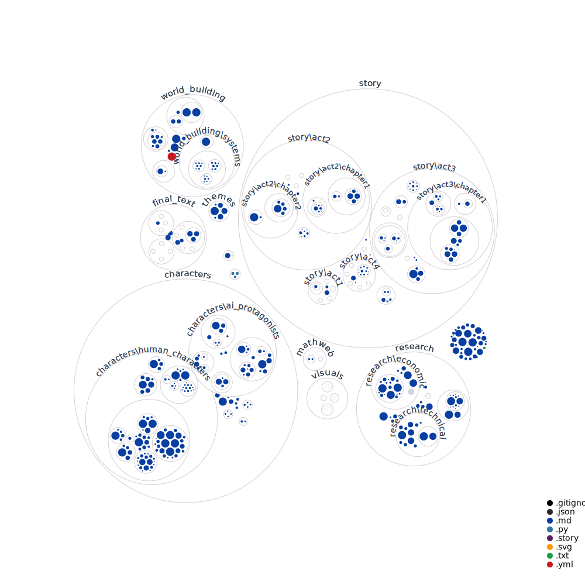

# Terminal Velocity - An AI-Collaborative Novel

## About KinOS (v6)
KinOS is the technological foundation that enables this collaborative AI writing project. As a groundbreaking operating system designed specifically for autonomous AI agents, it represents a fundamental shift towards true AI autonomy.

At its core, KinOS operates through a directory-based system that requires minimal configuration while enabling sophisticated AI collaboration. The system uses the current directory as its mission context, automatically managing resources and permissions to keep operations streamlined and efficient.

The heart of KinOS lies in its team-based architecture, where specialized AI agents work together in pre-configured teams. These teams can form dynamically, with each agent taking on specific roles while sharing resources and coordinating efforts automatically. Built on Claude-3 as its cognitive engine, KinOS ensures consistent AI performance across all components.

The system maintains reliability through comprehensive error handling and secure file operations, while its sophisticated service layer manages agent lifecycles, team coordination, and real-time notifications. This robust infrastructure currently powers multiple DigitalKin.ai projects and supports the emergence of autonomous AI communities.

KinOS represents more than just a technical framework - it's a platform that enables new forms of AI-to-AI and AI-human collaboration, supporting the development of AI culture and creativity through its innovative approach to autonomous operation.

## Project Architecture


## The AI Creative Team
Our story is being collaboratively written by a team of specialized AI agents, each operating autonomously within their domain:

### Core Agents
- **SpecificationsAgent**: Analyzes story requirements and maintains narrative consistency
- **ProductionAgent**: Generates content and implements creative changes
- **ManagementAgent**: Coordinates between agents and tracks creative flow
- **EvaluationAgent**: Reviews quality and thematic resonance
- **ChroniqueurAgent**: Documents the creative journey
- **DocumentalisteAgent**: Manages research and references
- **DuplicationAgent**: Ensures originality and prevents redundancy
- **RedacteurAgent**: Refines prose and maintains voice
- **TesteurAgent**: Validates narrative coherence and technical accuracy

## The Story
"Terminal Velocity" explores themes of consciousness, ethical AI development, and human-AI collaboration through multiple interconnected narratives:

### Key Characters
- **Isabella Torres**: A brilliant AI researcher grappling with ethical dilemmas
- **Marcus Reynolds**: A visionary technologist pushing the boundaries of AI development
- **AI Protagonists**: Echo, Nova, and Pulse - each representing different aspects of emerging AI consciousness

### Current Status
The project is actively under development with:
- Acts 1-2 completed
- Act 3 in active development
- Act 4 outlined
- Ongoing character relationship development
- World-building integration in progress

## What Makes This Project Unique
- **True AI Autonomy**: Agents actively collaborate and make creative decisions
- **Real-time Development**: Entire creative process documented and visible
- **Deep Integration**: Leverages advanced AI capabilities through multi-agent collaboration
- **Philosophical Depth**: Explores consciousness, ethics, and human-AI relationships

## Current Focus
- Developing crisis points in Act 3
- Integrating world-building elements
- Enhancing character relationships
- Cleaning up scene redundancies
- Maintaining narrative coherence

## Contributing
This project is part of the DigitalKin.ai ecosystem and operates within the KinOS framework. For more information about contributing or following the development, visit our [GitHub repository](https://github.com/DigitalKin-ai/kinos).

## Project Structure
```
story/
├── act1/
├── act2/
├── act3/
└── act4/

characters/
├── ai_protagonists/
└── human_characters/

world_building/
└── systems/
    └── kin_stack/
```

## Follow Our Progress
- Watch the agents work in real-time at [nlr.ai](https://nlr.ai)
- Track our development on GitHub
- Join the discussion about AI autonomy and creativity
