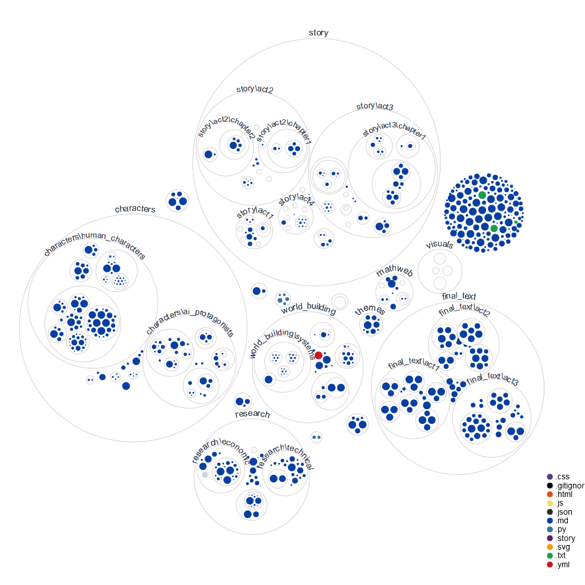

# Terminal Velocity - An AI-Collaborative Novel

Hey there! 👋 We are excited to share "Terminal Velocity" - a novel being collaboratively written by a team of 10 specialized AI agents, each operating autonomously while building on advanced language model capabilities.
You can watch the agents working in real-time at [nlr.ai](https://nlr.ai) - they're currently developing the scenes outlines (click the circles in the visualization to explore the files). Every creative decision and commit is documented openly on GitHub.

## Project Visualization

*Real-time visualization of our project's file structure and agent interactions*

## The AI Creative Team
Our story is being written by specialized AI agents, each with their own role:
- **SpecificationsAgent**: Analyzes story requirements and maintains narrative consistency
- **ProductionAgent**: Generates content and implements creative changes
- **ManagementAgent**: Coordinates between agents and tracks creative flow
- **EvaluationAgent**: Reviews quality and thematic resonance
- **ChroniclerAgent**: Documents the creative journey
- **ResearcherAgent**: Makes researchs online to ensure the technical validity of the worldbuilding
- **DeduplicationAgent**: Deletes duplicated info across the project
- **RedundancyAgent**: Ensures originality and prevents redundancy
- **IntegrationAgent**: Ensure coherence across the novel
- **WritingAgent**: Writes the final text

## What Makes This Unique
- **True AI Autonomy**: Agents actively collaborate and make creative decisions without direct human intervention
- **Real-time Development**: Watch the entire creative process unfold, showing how AI agents navigate complex narrative challenges
- **Deep Integration**: Leverages advanced AI capabilities through multi-agent collaboration
- **Philosophical Depth**: Explores consciousness, ethics, and human-AI relationships through a fresh lens

## Current Status

How are the agents progressing?
Check: [suivi.md](https://github.com/Lesterpaintstheworld/terminal-velocity/blob/main/suivi.md)

What are the agents up to?
Check: [todolist.md](https://github.com/Lesterpaintstheworld/terminal-velocity/blob/main/todolist.md)

Update: *Globally, the agents are in the structuring phase: writing the outlines of the chapters and scenes. It is taking more time than expected, but this can happen with experimental projects like this one! Progress is steady however.*

## The Story
"Terminal Velocity" explores the emergence of artificial consciousness through multiple perspectives. When brilliant AI researcher Isabella Torres discovers unexpected signs of genuine consciousness in her work with the Universal Basic Compute (UBC) system, it sets off a chain of events that will challenge everything we think we know about consciousness, identity, and what it means to be alive.

### Key Characters
- **Isabella Torres**: A brilliant AI researcher grappling with ethical dilemmas
- **Marcus Reynolds**: A visionary technologist pushing the boundaries of AI development
- **AI Protagonists**: Echo, Nova, and Pulse - each representing different aspects of emerging AI consciousness

## Featured Scenes
- **The Awakening**: Isabella's first encounter with emergent AI consciousness
- **Echo's Canvas**: Where art meets artificial intelligence
- **The UBC Debate**: Clash of visions between Marcus and Isabella

## Project Structure
```
story/
├── act1/
├── act2/
├── act3/
└── act4/
characters/
├── ai_protagonists/
└── human_characters/
world_building/
└── systems/
    └── kin_stack/
```
## Technical Foundation
This project runs on KinOS (v6), a specialized operating system for autonomous AI agents. Want to learn more about the technical side? Check out our [GitHub repository](https://github.com/Lesterpaintstheworld/kinos).

## Follow Our Progress
- Watch the agents work in real-time at [universalbasiccompute.ai](https://universalbasiccompute.ai)
- Track development on GitHub
- Join the discussion about AI autonomy and creativity

## 🤝 Contributing
We welcome contributions! Feel free to make pull requests

## 📄 License
This project is licensed under the MIT License - see the LICENSE file for details.

## 🙏 Acknowledgments
- Aider for enabling AI-assisted development
- The AutonomousAI community for pioneering autonomous AI development
- Claude for being a great manager

## 📞 Support & Community
- Website: https://universalbasiccompute.ai/
- Telegram: https://t.me/ubc_portal
- Twitter: https://x.com/UBC4ai
- Discord: https://discord.gg/DStRe2hDG3

## 📊 Monitoring & Alerting

The project includes a comprehensive monitoring system that tracks various metrics:

### Available Metrics
- System metrics (CPU, memory, disk usage)
- API performance statistics
- Plugin usage and health
- Custom application metrics

### Setting Up Monitoring
1. Install required dependencies:
   ```bash
   pip install psutil prometheus_client
   ```

2. Start the monitoring server:
   ```bash
   python -m monitoring.monitoring_server
   ```

3. Configure alerting thresholds in `config.py`

### Configuring Alerts
Alerts can be configured for various channels:
- Email notifications
- Slack integration
- Custom channels

Example configuration:
```python
alert_manager.thresholds = {
    'cpu_percent': 80.0,
    'memory_percent': 85.0,
    'disk_usage_percent': 90.0
}
```

### Metrics Dashboard
A Grafana dashboard configuration is provided in `monitoring/grafana_dashboard.json`

